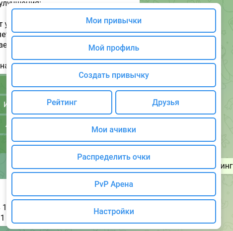
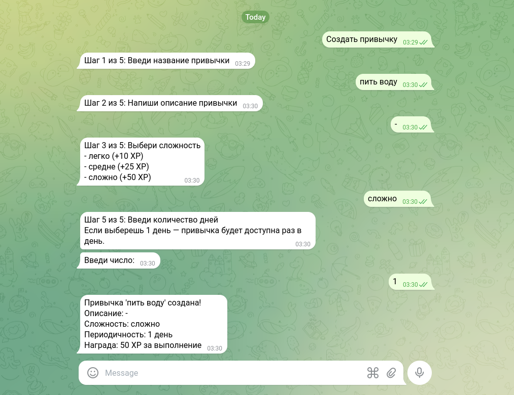
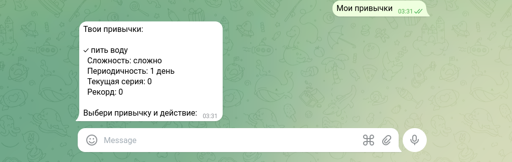
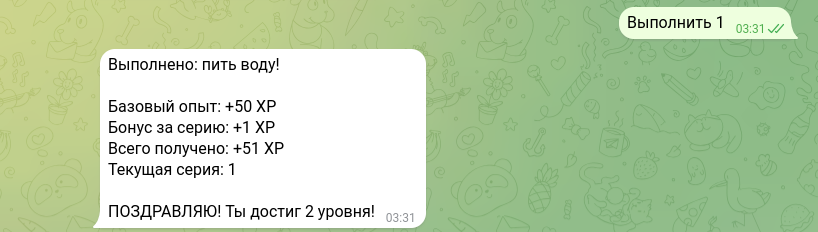
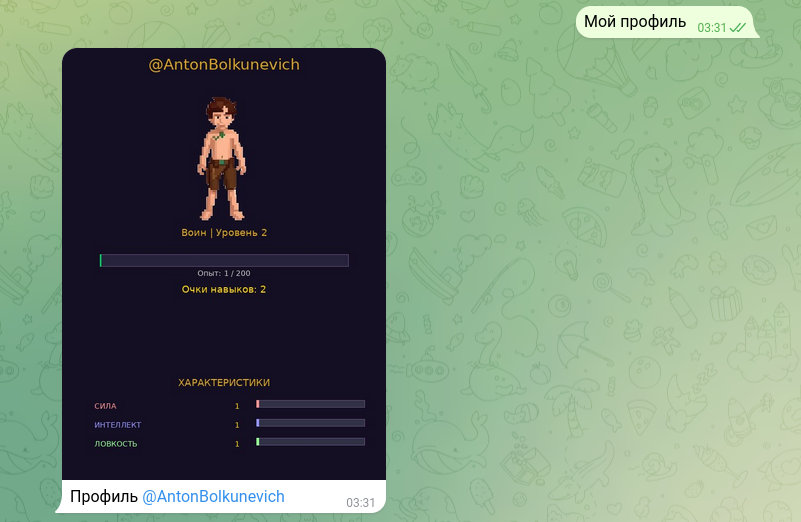
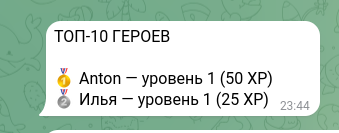
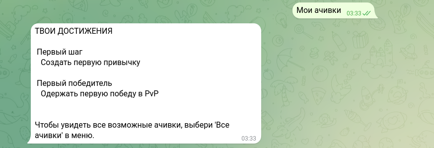
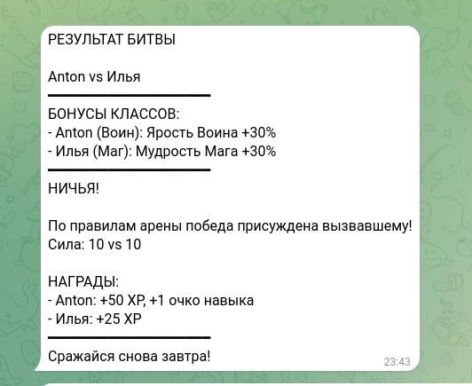

# RPG Habit Tracker — Telegram бот для геймификации привычек

RPG Habit Tracker — это Telegram бот, который превращает выполнение привычек в RPG-игру. С помощью этого бота пользователь сможет создавать привычки, выполнять их, получать опыт, повышать уровень, прокачивать навыки, соревноваться с друзьями в PvP и получать ачивки. Плюс этого проекта в том, что он не требует установки отдельного приложения — всё работает прямо в Telegram.

# Оглавление

- [Рекомендованные требования для запуска проекта](#рекомендованные-требования-для-запуска-проекта)
- [Установка и запуск](#установка-и-запуск)
- [Описание](#описание)
- [Команды бота](#команды-бота)
- [Пример использования](#пример-использования)

# Рекомендованные требования для запуска проекта

- Python: версия 3.10 или выше
- Операционная система: Linux, Windows, macOS
- Библиотеки: aiogram, sqlite3, pillow, apscheduler, python-dotenv
- Интернет: постоянное подключение для работы с Telegram API

[🔝Оглавление](#оглавление)

# Установка и запуск

### Для пользователя

Чтобы начать пользоваться ботом: найти бота в Telegram по username, отправить команду `/start`, выбрать класс персонажа (Воин, Маг, Разбойник), начать создавать привычки через кнопку «Создать привычку». Бот не требует установки дополнительного программного обеспечения.

### Для разработчика

Если Вы хотите развернуть бота локально или внести изменения в код, выполните следующие команды в терминале:
git clone https://github.com/FDAlmaz/habit_rpg_bot.git
cd habit_rpg_bot
python3 -m venv venv
source venv/bin/activate
pip install -r requirements.txt
echo "BOT_TOKEN=8387714208:AAEKRQsH8RvPqMr74mEw8PkTnnL45wwwdI0" > .env
python main.py

Для Windows вместо `source venv/bin/activate` используйте `venv\Scripts\activate`.

[🔝Оглавление](#оглавление)

# Описание

### Архитектура проекта

Проект организован по модульному принципу. Каждый модуль отвечает за отдельную функциональную область:

| Модуль | Назначение |
|--------|------------|
| `main.py` | Точка входа, инициализация диспетчера и роутеров |
| `database.py` | Работа с базой данных SQLite |
| `habits.py` | Создание, выполнение, удаление привычек |
| `profile.py` | Отображение профиля, генерация карточки персонажа |
| `friends.py` | Управление друзьями и рейтингом |
| `pvp.py` | PvP-соревнования |
| `achievements.py` | Система ачивок |
| `skills.py` | Распределение очков навыков |
| `settings.py` | Управление аккаунтом (удаление) |
| `reminders.py` | Система напоминаний |
| `image_generator.py` | Генерация изображений через Pillow |

### Игровые механики

- **Очки опыта (XP)**: начисляются за выполнение привычек (легко — 10 XP, средне — 25 XP, сложно — 50 XP)
- **Бонус за серию**: дополнительный опыт, равный текущей серии (стрику) пользователя
- **Уровни**: для повышения уровня требуется накопить 100 XP × текущий уровень
- **Очки навыков**: выдаются за каждый новый уровень (1 очко)
- **Характеристики**: сила, интеллект, ловкость — влияют на боевую силу в PvP
- **Ачивки**: выдаются автоматически при выполнении условий (первая привычка, 10 выполнений, достижение 5/10 уровня и др.)
- **PvP**: вызов друга на битву, расчёт силы с учётом характеристик и класса (Воин +30% к силе, Маг +30% к интеллекту, Разбойник +30% к ловкости)
- **Рейтинг**: отображается только среди друзей

### Система напоминаний

Бот автоматически отправляет напоминания о необходимости выполнить привычку за половину периода до окончания (для всех типов периодичности), дополнительно за 1 день и за 1 час для периодов более 1 дня. Напоминание отправляется только один раз за период.

### Визуализация персонажа

Карточка персонажа генерируется динамически с использованием библиотеки Pillow из PNG-ассетов, разделённых по классам (Воин, Маг, Разбойник) и уровням (1, 5, 10, 20). На карточке отображаются: имя, уровень, опыт, прогресс-бар, серия, рекорд, очки навыков, характеристики, класс.

[🔝Оглавление](#оглавление)
## Скриншоты работы бота

### Главное меню и старт

### Создание привычки

### Список привычек

### Выполнение привычки

### Профиль персонажа

### Рейтинг среди друзей

### Система ачивок

### PvP-битва

# Команды бота

| Команда / кнопка | Описание |
|------------------|----------|
| `/start` | Начать работу, зарегистрироваться, выбрать класс |
| `Мои привычки` | Показать список привычек |
| `Мой профиль` | Показать карточку персонажа |
| `Создать привычку` | Создать новую привычку |
| `Рейтинг` | Показать рейтинг среди друзей |
| `Друзья` | Показать список друзей и входящие заявки |
| `/add_friend @username` | Отправить заявку в друзья |
| `/accept @username` | Принять заявку в друзья |
| `Мои ачивки` | Показать полученные и доступные ачивки |
| `Распределить очки` | Распределить очки навыков |
| `PvP Арена` | Вызвать друга на битву, посмотреть историю |
| `/fight @username` | Вызвать пользователя на битву |
| `Настройки` | Управление аккаунтом (удаление) |
| `Главное меню` | Вернуться в главное меню |
| `Отмена` | Отменить текущее действие |

[🔝Оглавление](#оглавление)

# Пример использования

**Создание привычки:** пользователь нажимает «Создать привычку» → вводит название «Пить воду» → вводит описание «Выпивать 2 литра воды в день» → выбирает сложность «средне» → выбирает единицу измерения «День» → вводит количество «1» → бот сообщает: «Привычка 'Пить воду' создана! Награда: 25 XP за выполнение».

**Выполнение привычки:** пользователь нажимает «Мои привычки» → нажимает «Выполнить 1» → бот сообщает: «Выполнено: Пить воду! Базовый опыт: +25 XP, Бонус за серию: +1 XP, Всего получено: +26 XP».

**PvP-битва:** пользователь нажимает «PvP Арена» → вводит `/fight @durov` → бот рассчитывает силу, определяет победителя и сообщает результат.

### Примеры запуска в терминале (логи бота):
$ python main.py
База данных инициализирована
Система напоминаний запущена
Бот успешно запущен!

[🔝Оглавление](#оглавление)